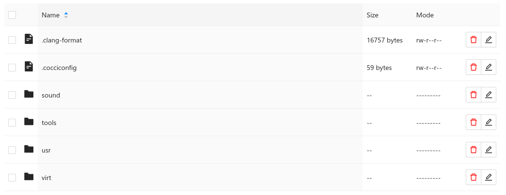

# File Manager Component(s) for React
[](https://github.com/codefreak/react-file-manager/actions/workflows/tests.yml)



This is a monorepo with multiple packages:

* `@codefreak/react-file-manager` contains some generic code for D&D and selection handling. You will need some additional code to make it render something.
* `@codefreak/antd-file-manager` contains an implementation based on AntD's `<Table/>` component. Check out how we use it in [codefreak](https://github.com/codefreak/codefreak/search?q=antd-file-manager&type=code)

## Features
* Move items around via drag&drop
* Drop native files onto directories ("uploading")
* Batch-move via selection (AntD specific)
* Renaming and deleting items (AntD specific)

## Installation
```
npm install -S @codefreak/antd-file-manager
// or if you are using yarn
yarn add @codefreak/antd-file-manager
```

## Development
```
git clone https://github.com/codefreak/react-file-manager.git
cd react-file-manager
yarn install
yarn start
```
This should bring up Storybook in your browser with some basic examples.

## Publish a new release
This is only possible if you have access to our `@codefreak` npm organisation.
```
yarn run lerna publish
```

## License
The source code for all packages in `./packages` is licensed under the MIT license, which you can find in the `LICENSE` file.